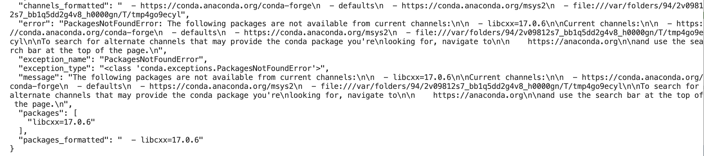

## System Specs

- Model: MacBook Pro (13-inch, 2020, Two Thunderbolt 3 ports)
- Processor: 1.7 GHz Quad-Core Intel Core i7 (Intel(R) Core(TM) i7-8557U CPU @ 1.70GHz)
- Architecture: x86_64 (Intel)
- Memory: 16 GB 2133 MHz LPDDR3
- Graphics: Intel Iris Plus Graphics 645 1536 MB
- OS: macOS Sonoma 14.6.1 (Build 23G93)

## Conda Lock File Generation

I used [conda-lock](https://github.com/conda/conda-lock) to make sure everyone can get the exact same environment.

### Platform Issue

When I first ran `conda-lock`, it tried to make lock files for all platforms. But some packages we use (like `libcxx=17.0.6`) aren’t available on Windows, so it threw an error (see screenshot).


To still generate a lock file here, I need to tell `conda-lock` to only make lock files for Mac (Intel and Apple Silicon) and Linux:

```sh
conda-lock lock --platform osx-64 --platform osx-arm64 --platform linux-64
```

This way, it skips Windows and works fine for us.

